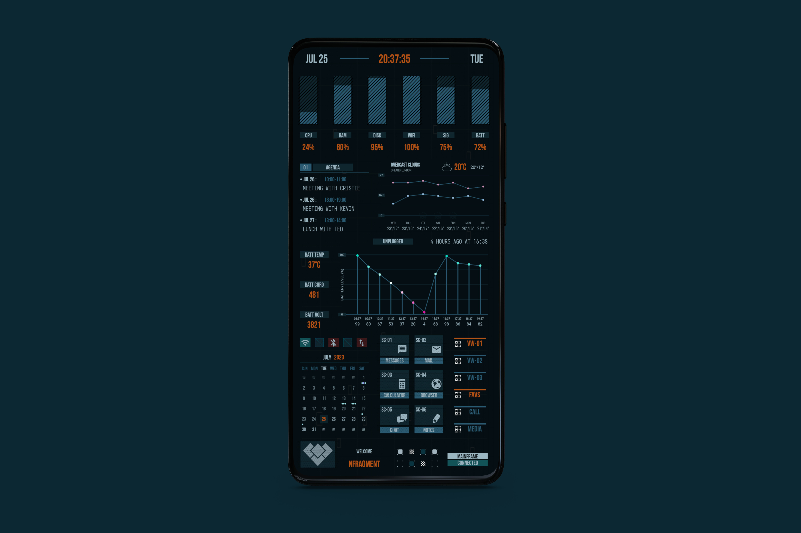
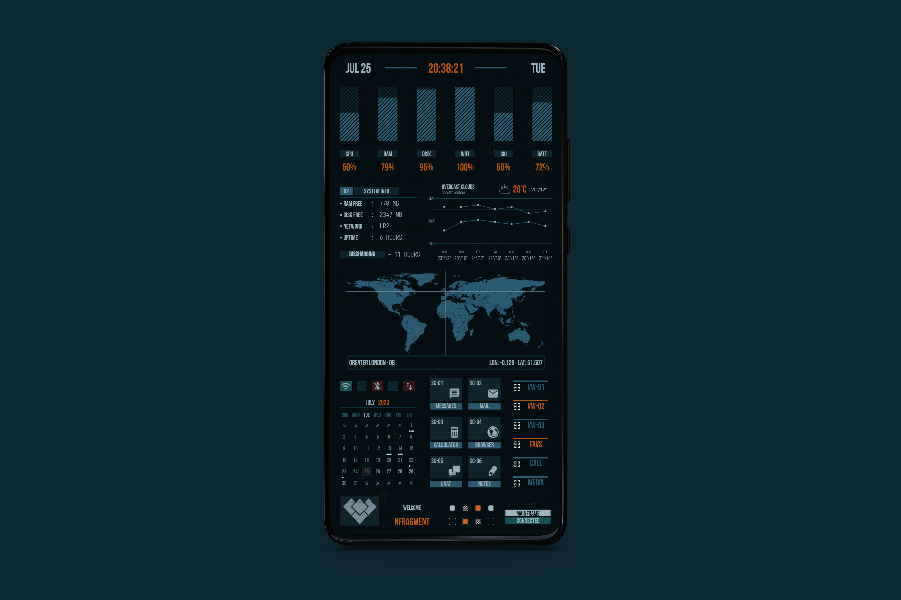
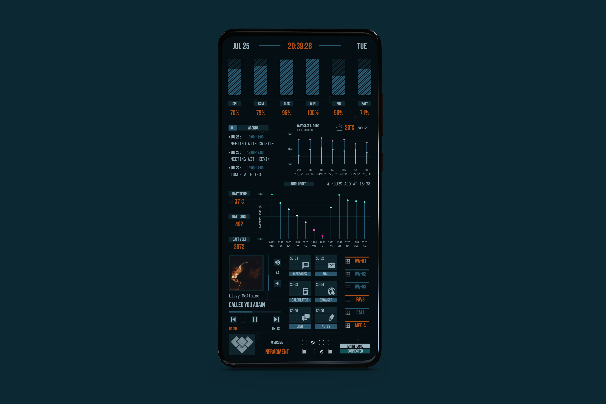

# DHRISHTI FOR KLWP

A Sci-Fi inspired theme / preset for [KWLP](https://play.google.com/store/apps/details?id=org.kustom.wallpaper)

## SCREENSHOTS

### Preview 1

### Preview 2

### Preview 3

## FEATURES

- Bar chart visualization of critical system resources,

    - current CPU Usage
    - current Ram Usage
    - current Storage Utilization
    - current WiFi signal strength
    - current Cell Network signal strength
    - current Battery state

- Chart of last **12 hours Battery History**

- Chart of next **7 days Weather Forecast**

- Agenda view of next **3 Upcoming Events**

- World map showing **Current Location**

- Current month **Calender with Event Indicators**

- 6 App / Activity shortcuts (user configurable)

- 6 speed-dial shortcuts (user configurable)

- Media controls (can be shown only when needed)

- Critical toggle status monitor (Wifi, Bluetooth, Data, Airplane Mode)

- Battery charging status indicator and tracker

- Battery info like,

    - current Battery Temperature
    - current Battery Voltage
    - current Battery Charge / Discharge rate

## GETTING STARTED

- Download the latest release
- Copy the downloaded `dhrishti_v1.klwp` file to `your kustom wallpaper directory`, which is most likely `kustom/wallpapers` directory in your internal storage.
- Open KLWP and the preset will appear in the `Library` section.
- select and apply it.

## CREDITS

A special thanks to these amazing people for the support, resources and sharing their excellent works. This project utilizes some of their works as-is or by modifying it to fit the project requirements.

- [Brandon Craft](https://www.bcraftmath.com/meetcraftmath.html) : for their chart komponent and tutorials on youtube
    - check out [this link](https://www.bcraftmath.com/klwp.html) to find the komponent and even more goodies.
    
- [Christopher Martell (CMX)](https://www.reddit.com/user/ChristopherMartellX) : for the [World Map Komponent](https://www.reddit.com/r/kustom/comments/c81jzv/cmx_old_school_world_map_komponent)

- [Erik Bucik](https://klwp.erikbucik.com/komponents#h.s_t1QmMldYLCAb) : for the [Blueprints: calendar komponent](https://play.google.com/store/apps/details?id=eb.kustom.blueprints)

- [zlatko_plamenov / Freepik](https://www.freepik.com/author/zlatko-plamenov) : for the [Smartphone Mockup](https://www.freepik.com/free-psd/smartphone-mock-up-isolated_4075388.htm)

- [Kustom reddit community (r/kustom)](https://reddit.com/r/kustom) : for all the help support and inspiration
